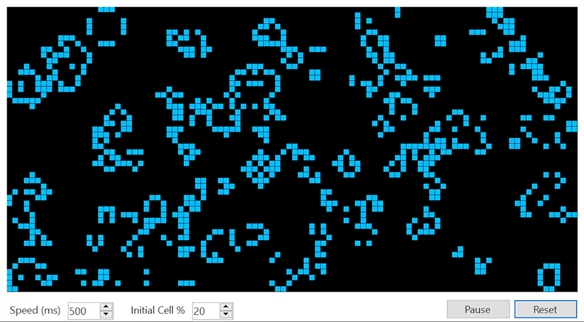

# Conway's Game of Life
[Conway's Game of Life on Wikipedia](https://en.wikipedia.org/wiki/Conway%27s_Game_of_Life)  
A zero-player game featuring cellular automata, where cells either live or die depending on the number of cell neighbors that they have.  

Conditions:
* If a square has 3 cell neighbors, a cell is spawned in that spot.
* If a cell has less than 2 or more than 3 cell neighbors, the cell dies.

Implemented in C# with WinForms as GUI.  
The algorithm has time and space complexity of ***O(M\*N)***, where M and N represent rows and columns respectively.  
Currently work in progress. Different implementations of Life are planned.

## Preview

